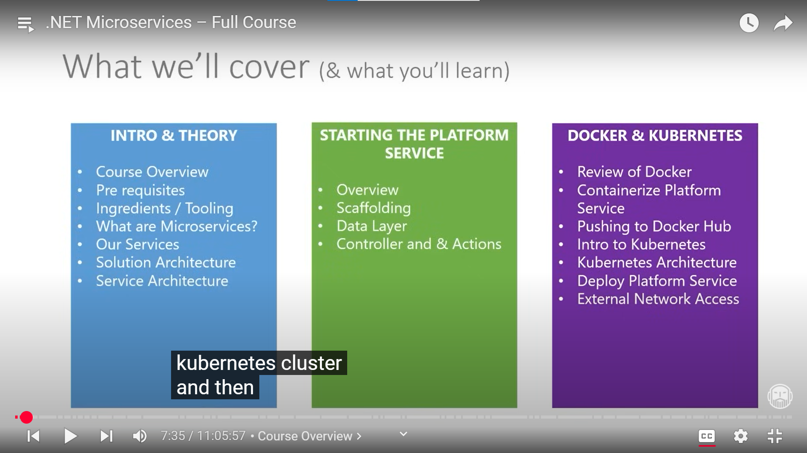
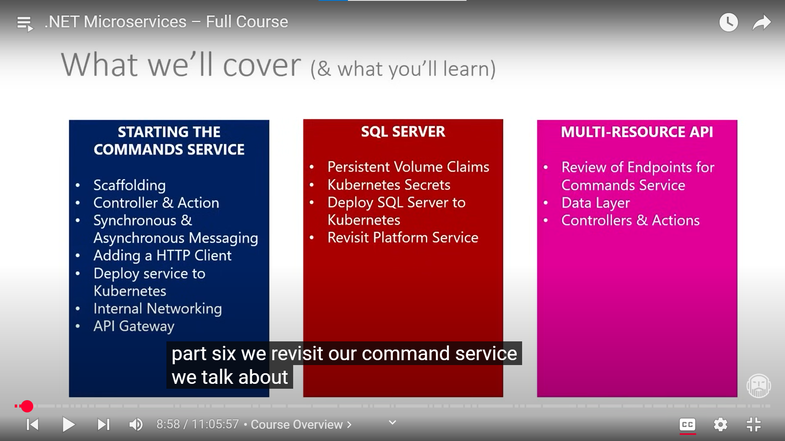
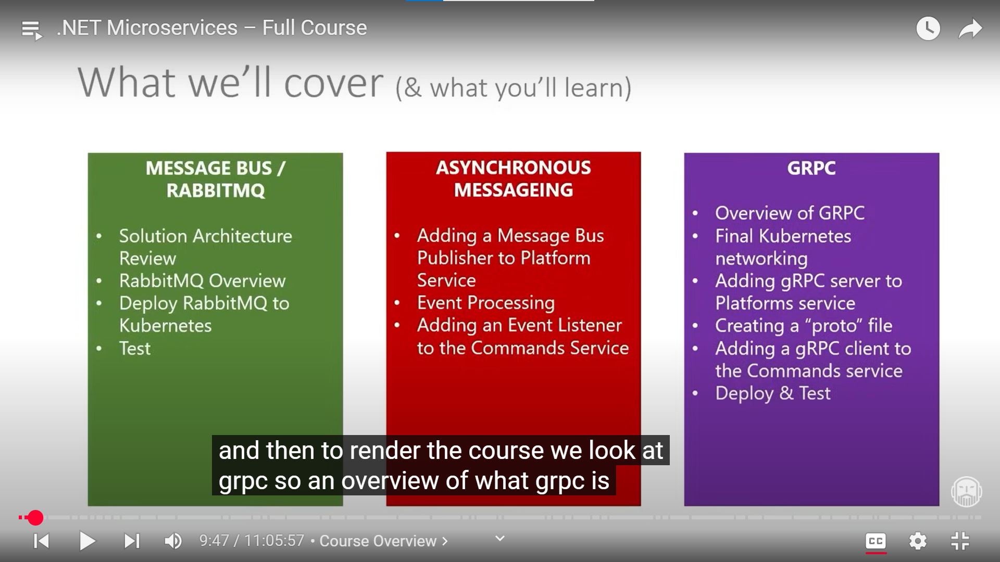
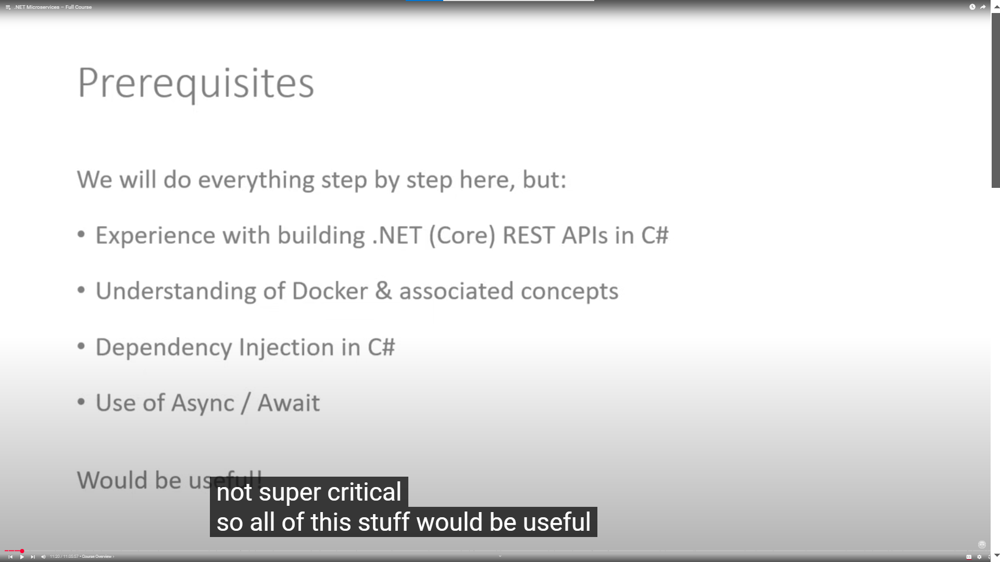

# Overview

### What you learn from this 

 - Each section covers all of the them leter

- gRpc  stands for Google Remote Procedure Call
- Protocol Buffers (protobuf) 
- High performance
- Cross-language support
- Bidirectional streaming
- Code generation

