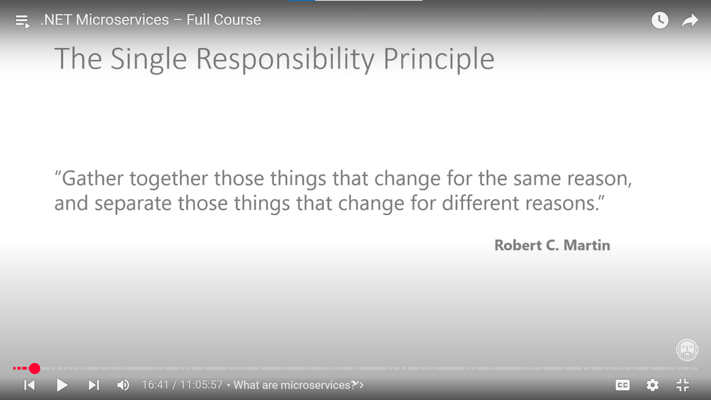
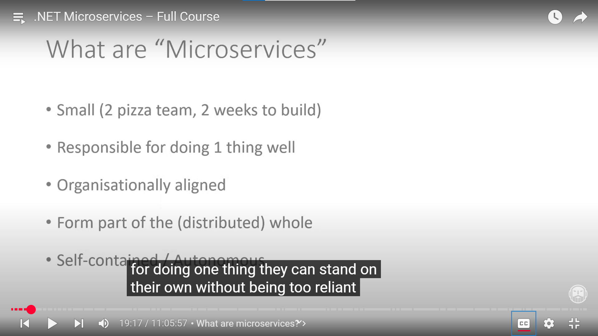
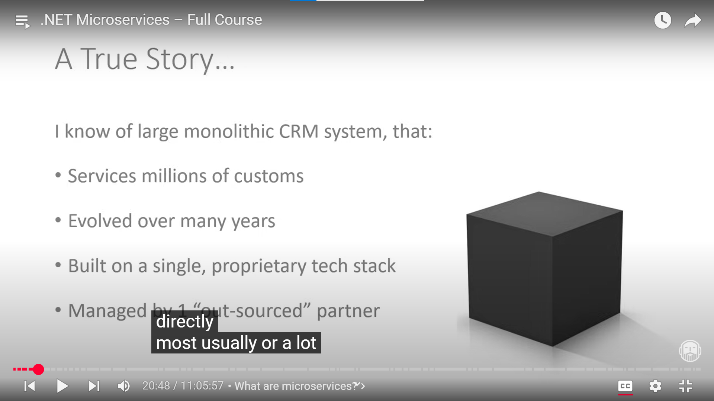
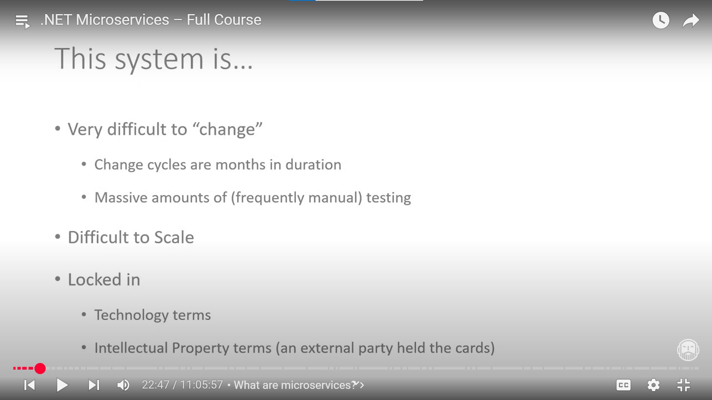
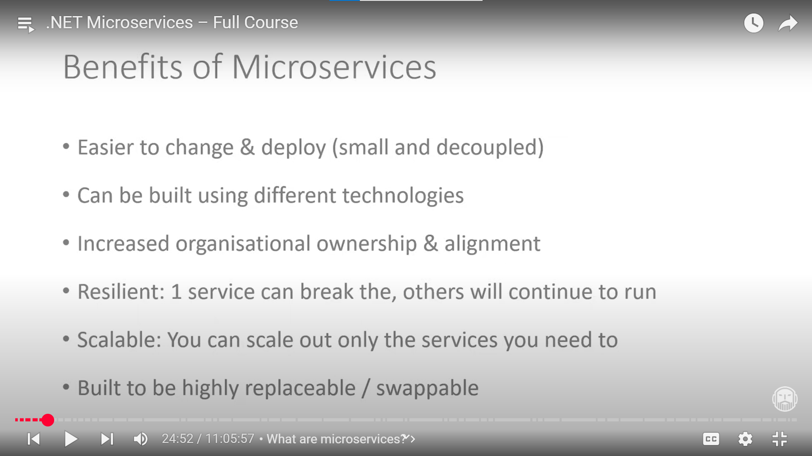
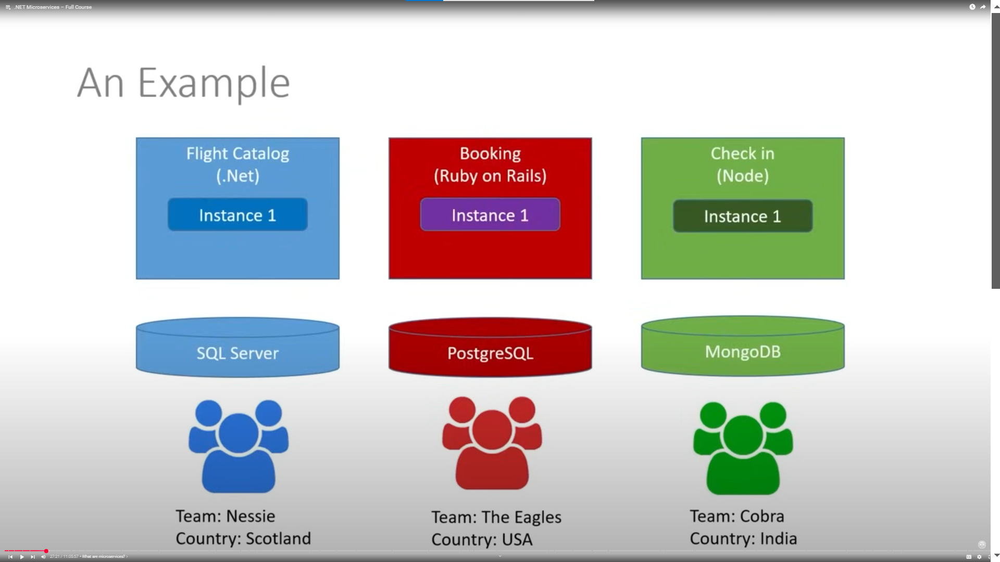
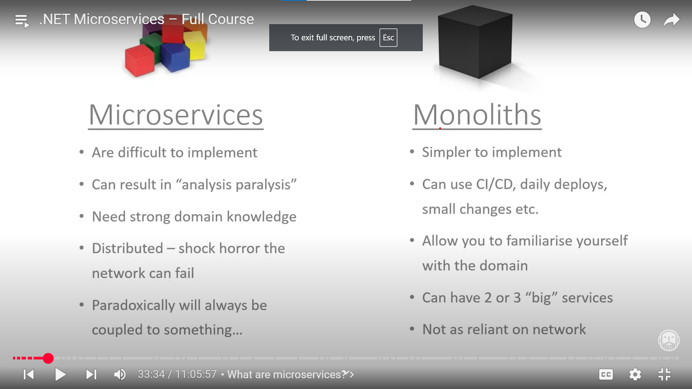

# What is Micoservice

- smaller size and induvidal deployed and scallable (docker spining up by Kubernetes)
- talk each other for done somethings
- smaller team and smaller project size
- do one jobs acurately 

- Undertanding Real application Monolithic is the best example 
- what is drawback is that
- what problem are going to solve the Microservices 
- Not always overenginering 

- drawbaked of monolithic
    - Dificult to change 
    - Hole application test lots of time
    - Dificault to Scale - Hole application need to scale
    - lets only oders of customer of CRM project that time entier application need to scale
    - Rewrite application more chalange it is outsourcing project then 
    - Brain behind problem happened 

- Benifit of Microservices
    - easy to scale 
    - easy to developed
    - any language tool can be used on demand of team and condition best suitable for
    - any service is brokend then other can run

- Example of Microservices
    - 3 different
    - own services has on datastore
    - thes services talks to each other
    - if one service goes down then others service runing up

- Microservices VS Monolithic
    - Microservices
    - 1 or more monolithic applications build microservices
    - Microservices dificult to Architecture
    - Distributed microservices nework call can be slow do cosideration when desing
    - to more talk each service can be overloaded consideration 
    - microservices not awlays decuple sometimes need to call every service

    ---
    - Monolithic 
    - simpler to implement
    - daily smaller changes can be done CI/CD piple line can help
    -  network related issue less coz not some much call not happend between different services (2/3 big service)

