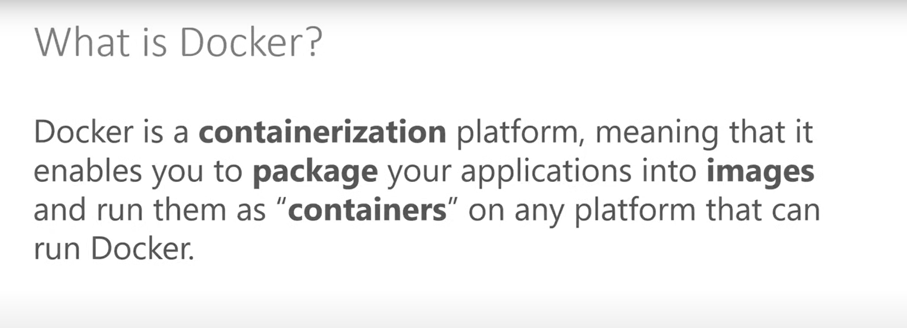
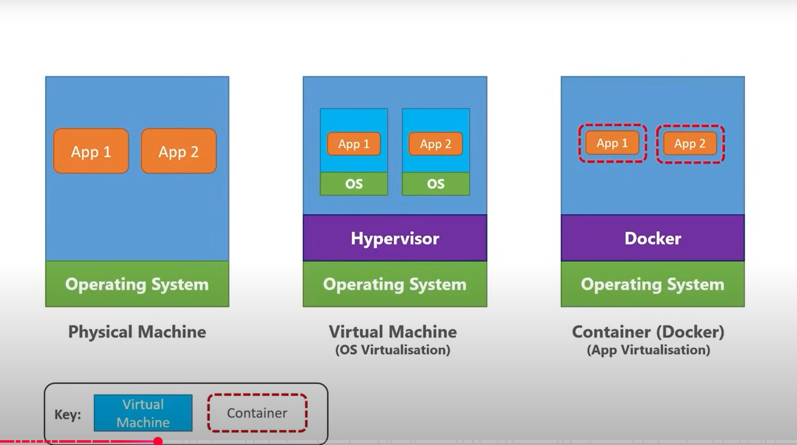
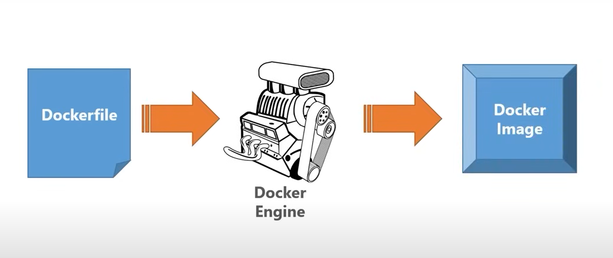

## Docker 

- application run on your local machine 
- same environment in production got mixed up
- docker give solution so that you can same environment in production using docker
- by creating a image

### Physical machine

- OS and run multipule application 

### Virtual machine VS Container

- Container running on docker (image to create container)
- Hypervisor give solution for virtual machine (Individual application instance run o OS)
- Docker give solution for (Combined together application all its environment)

### Hroizontal Scaleing using 

- using docker Scaleing same application instance multiple times
- multiple containers running on the same machine and same application

### How our Platform application running or docker

- Dockerfile => Docker Engine => Docker Image

### Docker basic commands 

- => docker build . -t mehedi/platformservices   (Create docker image from docker compose instruction)
- => docker images   (Show all docker images created)
- => docker run -p 5007:80 -d mehedi/platformservices  (run docker image as container process)
- => docker start mehedi/platformservices  (start docker same runing restart image as container process)
- => docker stop mehedi/platformservices (stop docker)

