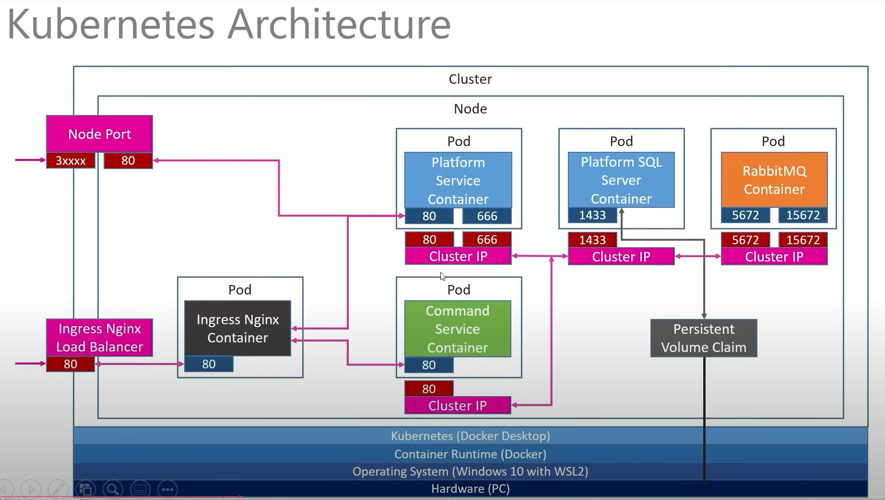
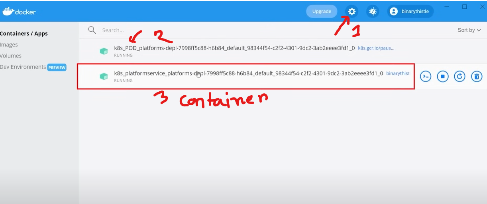
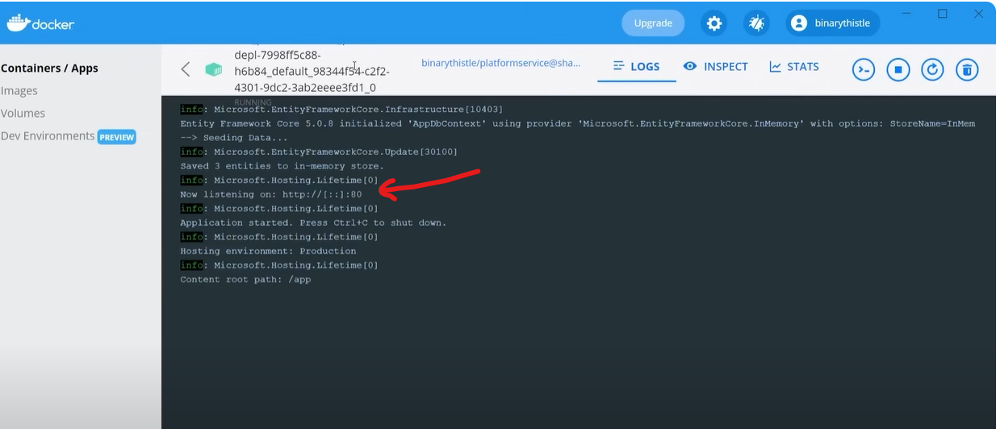
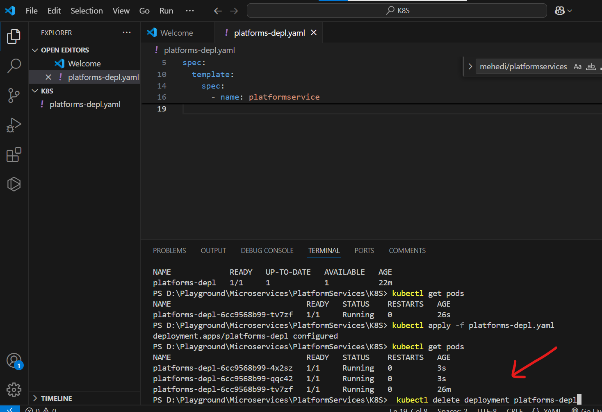
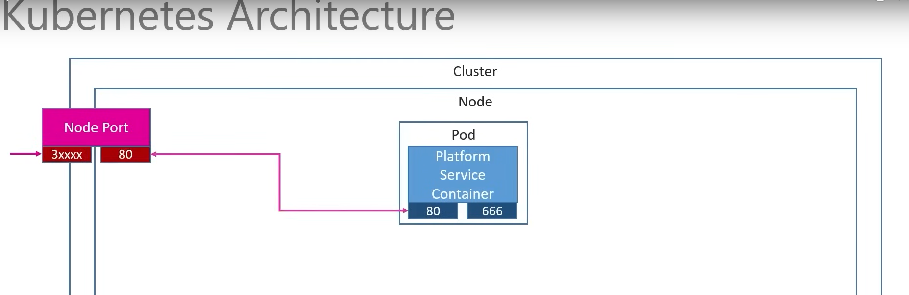
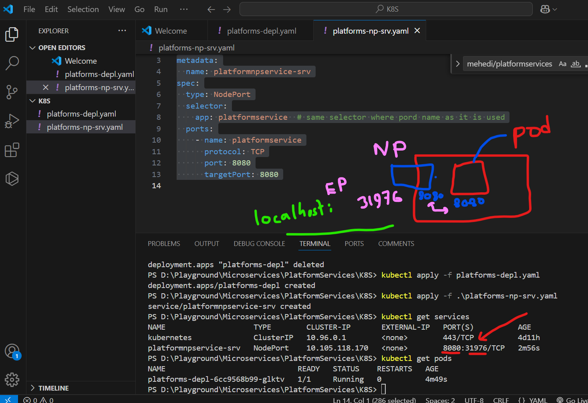

### Kubernetes 

- Hardware 
- OS (windows with WSL2)
- Container Runtime (Docker)
- Kubernetes (Docker Desttop, settings to check click) 
- Cluster 
- Node (it can be multiple node)
- Pod (Platform) (meas like container 1 pod can have run multipule container)
- Node Port (extranal request pass into pod inside container)
- Nginx (Load balancer)
- Cluster IP (Interal pod compunication)



### Create ymal file first 

```yaml
apiVersion: apps/v1
kind: Deployment
metadata: 
  name: platforms-depl
spec:
  replicas: 1
  selector:
    matchLabels:
      app: platformservice
  template:
    metadata:
      labels:
        app: platformservice
    spec:
      containers:
      - name: platformservice
        image: mehedi/platformservices  # docker hub then : verison mention 
        imagePullPolicy: Never  # Important for using local images
       
       
```

- then run command
```bash

- => kubectl version
- => kubectl apply -f ymal-file-name
- => kubectl get deployments   // to see all deployments
- => kubectl get pods // run pods

``` 





- we can replicas: 3 
- then apply kubectl
- get pods pods up and running of 3 instance of container of single application
- three pods and three container is up and running 

```bash
    kubectl delete deployment deployment-name-whatever-created
```


### we have to create nodePots to give access to container instance from outside to kubernetes => container instance

- create file => platfrom-np-srv.yaml
- 



```yaml
apiVersion: v1
kind: Service
metadata:
  name: platformnpservice-srv
spec:
  type: NodePort
  selector:
    app: platformservice  # same selector where pord name as it is used
  ports:
    - name: platformservice
      protocol: TCP
      port: 8080
      targetPort: 8080
       
```

- run command
- => kubectl apply -f platform-np-srv.yaml 
- => kubectl get services                  // To know services i created 

