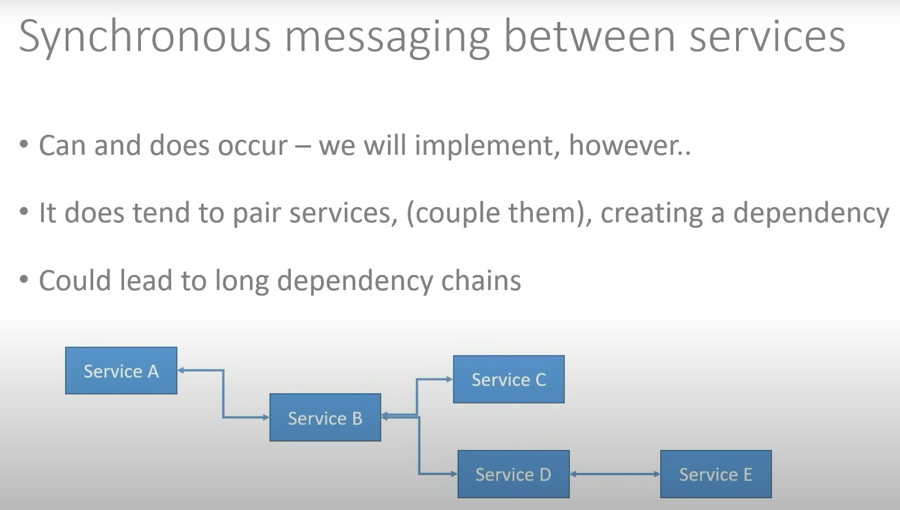
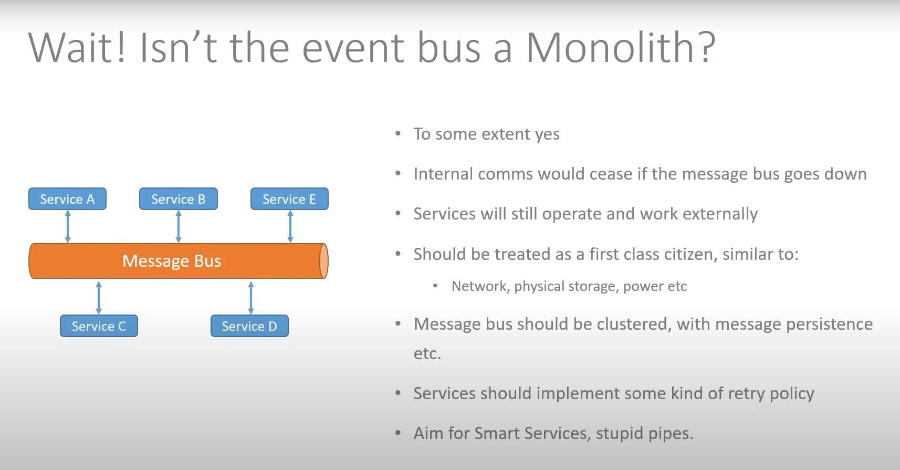

## Services to Services Messages communication

- Synchronus  and Asynchronous

#### Synchronous
- Most of the extranal request are Synchronus
- Internal Services to Servies can be both Synchronized and Asynchronous

- Chaty comunication to Services to services 
- and if network fail what happend 
- long running service call

#### Asynchronous Messaging 

- No Request / Response Cycle 
- Requestor does not wait 
- Event model, e.g. Publish - Subscribe 
- Typically used between services 
- Event bus is often used (We'll be using RabbitMQ)
- Services don't need to know about each other, just the bus 
- like massage queue push the request and other services know and polling the request and the response
- do not know each other

