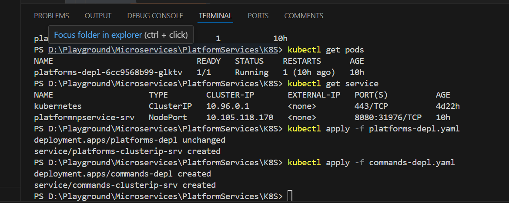

#### Kubernetes cluster IP to comunication 

- Platform Service to Command Services HttpClient comunication 


- platforms-depl.yaml file


```yaml
apiVersion: apps/v1
kind: Deployment
metadata: 
  name: platforms-depl
spec:
  replicas: 1
  selector:
    matchLabels:
      app: platformservice
  template:
    metadata:
      labels:
        app: platformservice
    spec:
      containers:
      - name: platformservice
        image: mehedi/platformservices
        imagePullPolicy: Never  # Important for using local images
---
apiVersion: v1
kind: Service
metadata:
  name: platforms-clusterip-srv
spec:
  type: ClusterIP
  selector:
    app: platformservice
  ports:
  - name: platformservice
    protocol: TCP
    port: 80
    targetPort: 80

```

- commands-depl.yaml file 

```yaml
apiVersion: apps/v1
kind: Deployment
metadata: 
  name: commands-depl
spec:
  replicas: 1
  selector:
    matchLabels:
      app: commandsservice
  template:
    metadata:
      labels:
        app: commandsservice
    spec:
      containers:
      - name: commandsservice
        image: mehedi/commandsservice
        imagePullPolicy: Never  # Important for using local images
---
apiVersion: v1
kind: Service
metadata:
  name: commands-clusterip-srv
spec:
  type: ClusterIP
  selector:
    app: commandsservice
  ports:
  - name: commandsservice
    protocol: TCP
    port: 80
    targetPort: 8080   # container listening port 
```


- and also specify the prot :80 





- => kubectl apply -f platforms-depl.yaml
- => kubectl apply -f commands-depl.yaml


- Restart deployment 
- => kubectl rollout restart deployment platforms-depl
- => kubectl get pods