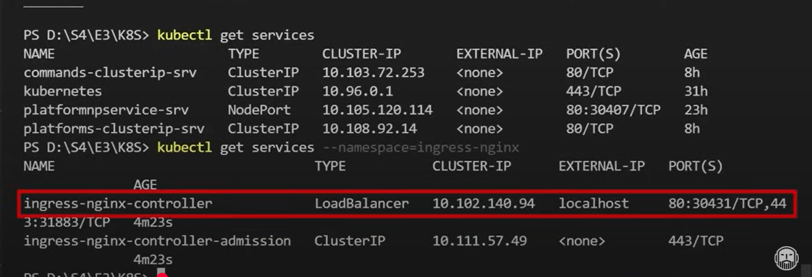

### Ingix Ingress controller 


- => kubectl apply -f https://raw.githubusercontent.com/kubernetes/ingress-nginx/controller-v1.12.0/deploy/static/provider/aws/deploy.yaml

- when we are working on applicaiton deployment 
- that are into default namespace
- when we are ingress that is diffrent namespace

- => kubectl get namespace

- ingress is running to see
- => kubectl get pods --namespace=ingress-nginx


 
- networking stuff



- some configuration for setup the ingress-nginx route pass to our platform service 
- instead of nodePort 
- production way we can use the ingress-nginx

- create yaml file => ingress-srv.yaml

```yaml

``` 

- give IP open into windows host file => C:\Windows\System32\drivers\etc


- => http://acme.com/api/platforms  
